# LinkedPipes Android Client
An android client for the ETL LinkedPipes system.
## Developer documentation
Developer documentation including the javadoc documentation can be found [here](https://github.com/Palda97/AndroidEtlClientDeveloperDocumentation).
## System requirements

- Android 5.0 or greater.
- At least 40 MB of space.
- Internet connection.
- Optionally - camera for loading server information via QR code

## UI Documentation
Manual to app's user interface.
### Main screens
Executions | Pipelines | New Pipeline Dialog
-----------|-----------|---------------------
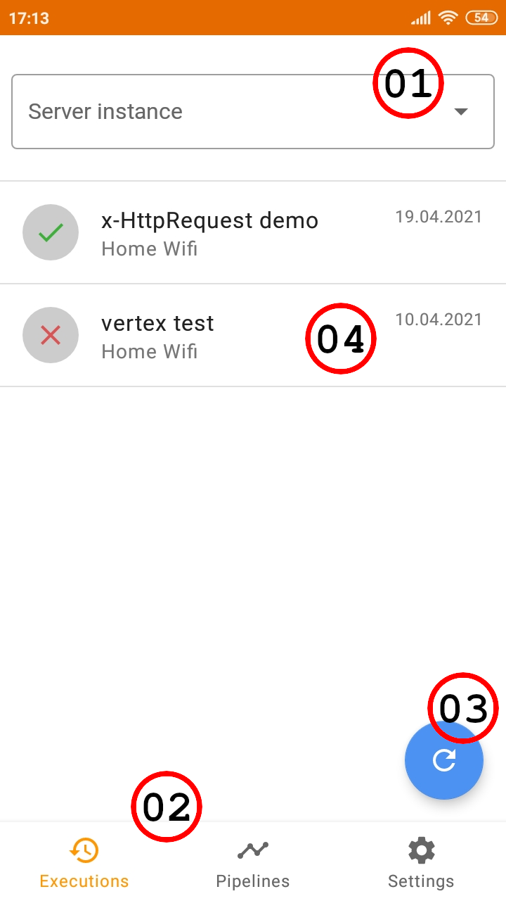|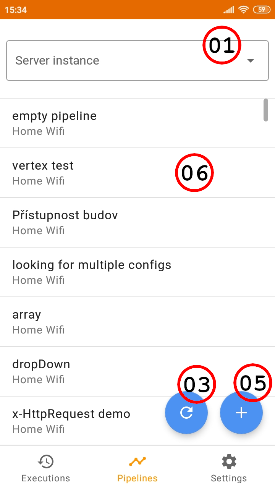|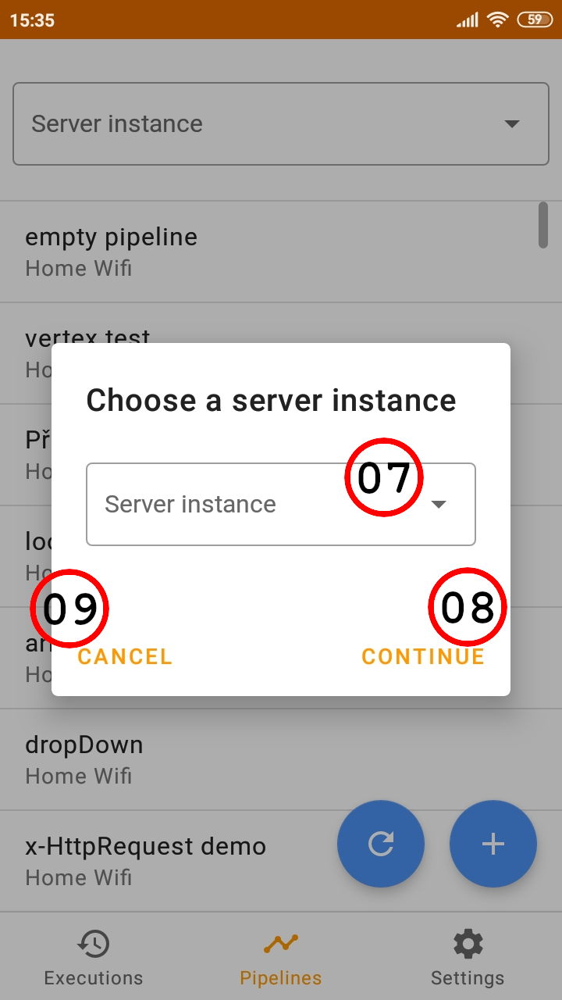

<ul>
	<li>01) You can filter content by selecting a server instance from the drop-down menu.</li>
	<li>02) The bottom navigation. Use it to navigate between the execution, pipeline and settings screen.</li>
	<li>03) The refresh button, to refresh both executions and pipelines.</li>
	<li>04) Execution item. You can long press it to execute the pipeline once again. Slide to any side to delete the execution. After sliding, the UNDO option will be visible for about 5 seconds.</li>
	<li>05) Create new pipeline. Pressing this button will initialize a dialog for choosing a server.</li>
	<li>06) Pipeline item. Long press to execute the pipeline. Simple click to edit. Slide to delete. After sliding, the UNDO option will be visible for about 5 seconds.</li>
	<li>07) Choose a server instance which you wish to create the pipeline on.</li>
	<li>08) After pressing the "continue" button, an empty pipeline will be created on the selected server and the edit pipeline screen will appear.</li>
	<li>09) Clicking the "cancel" button or outside of the dialog window will cancel the pipeline creation.</li>
</ul>

Settings | Edit Server
---------|-------------
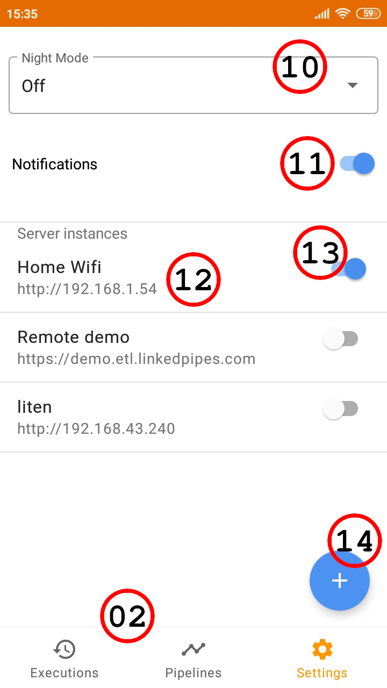|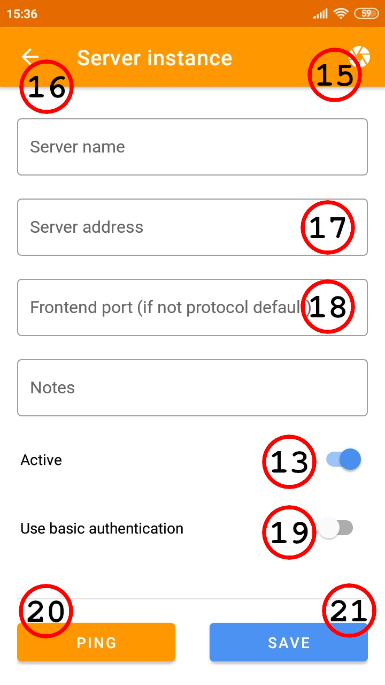

<ul>
	<li>10) The night mode option. You can turn night mode on, off and since android 10, you can select the "System default", so the night mode will be driven by the system settings.</li>
	<li>11) Turns notifications on or off.</li>
	<li>12) Server instance item. Click to edit. Slide to delete. After sliding, the UNDO option will be visible for about 5 seconds.</li>
	<li>13) The active switch. The app will not communicate with servers marked as not active.</li>
	<li>14) Register a new server instance.</li>
	<li>15) Load server information from QR code.</li>
	<li>16) Cancel the server registration.</li>
	<li>17) Server instance address including the protocol (HTTP/HTTPS)</li>
	<li>18) Enter the front-end port. If the server uses the default protocol port (80 for HTTP and 443 for HTTPS), leave this field empty.</li>
	<li>19) If you tick this switch, two new fields will appear for username and password.</li>
	<li>20) Pings the server. The app tries to do an API call and if unsuccessful, it proceeds with the regular ping.</li>
	<li>21) Finish the server registration.</li>
</ul>

### Pipeline Editor
Pipeline | Add Component Dialog | Save Pipeline Dialog
---------|----------------------|----------------------
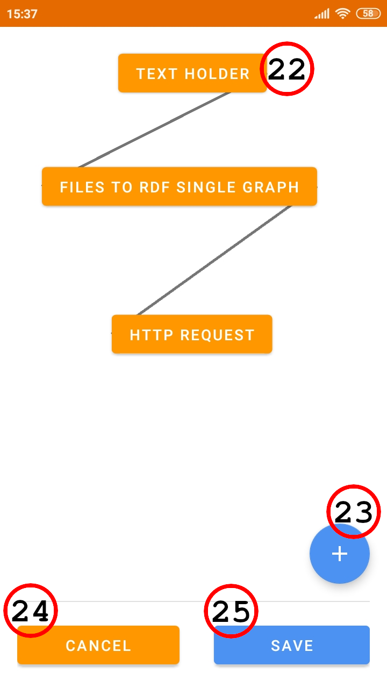|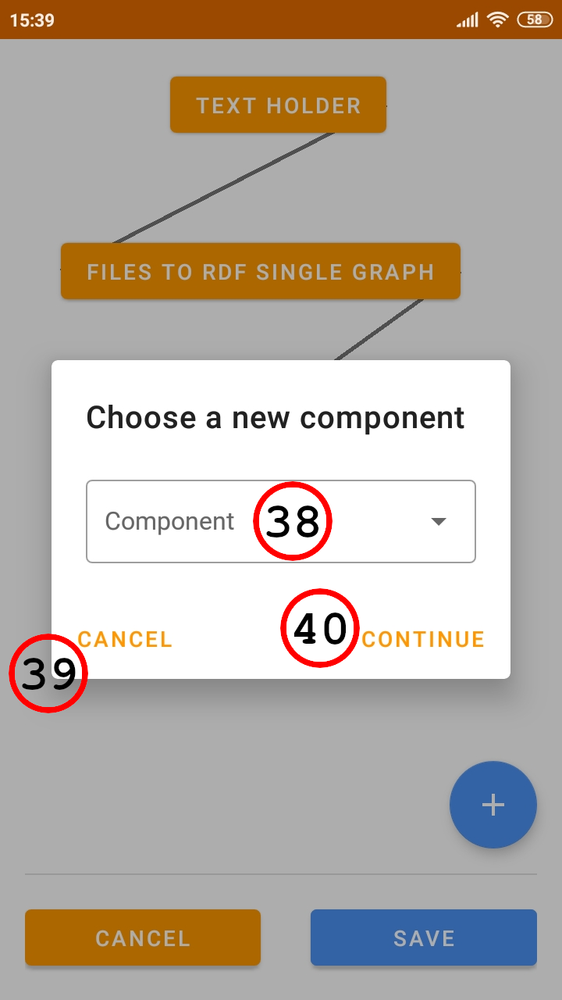|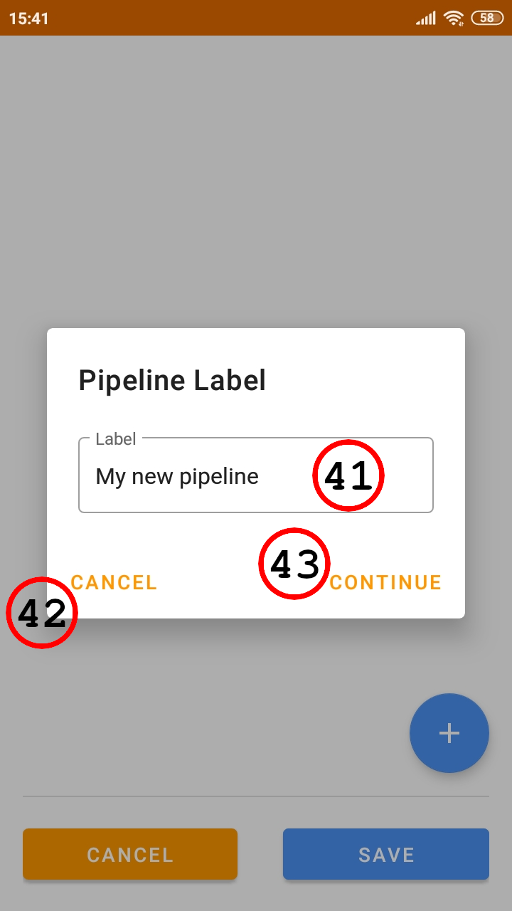

<ul>
	<li>22) A component inside the selected pipeline. Click the component to edit it. Click and hold to move the component on the screen.</li>
	<li>23) Add a component to the pipeline. Clicking this button will initialize the choose component dialog.</li>
	<li>24) Stop editing the pipeline and discard all changes.</li>
	<li>25) Save the pipeline. Clicking this button will initialize the save pipeline dialog, where you are able to change the pipeline's label before uploading.</li>
	<li>38) Choose a component to be added to the current pipeline.</li>
	<li>39) Clicking the "cancel" button or outside of the dialog window will cancel the component addition.</li>
	<li>40) Clicking the "continue" button will add the selected component to the current pipeline.</li>
	<li>41) Choose a name for the pipeline before uploading it.</li>
	<li>42) Clicking the "cancel" button or outside of the dialog window will cancel the pipeline upload and return you back to the edit pipeline screen.</li>
	<li>43) Clicking the "continue" button will upload the pipeline on server. The app will inform you on the upload success.</li>
</ul>

### Component Editor
Configuration | General | Inheritance
--------------|---------|-------------
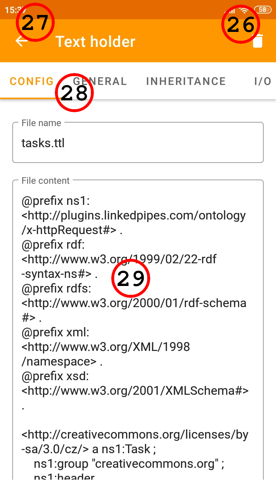|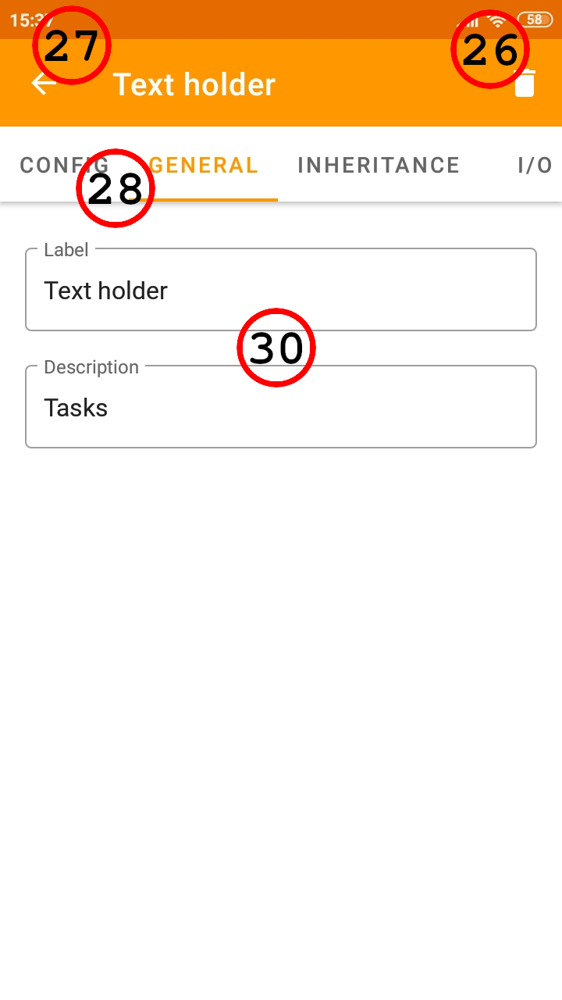|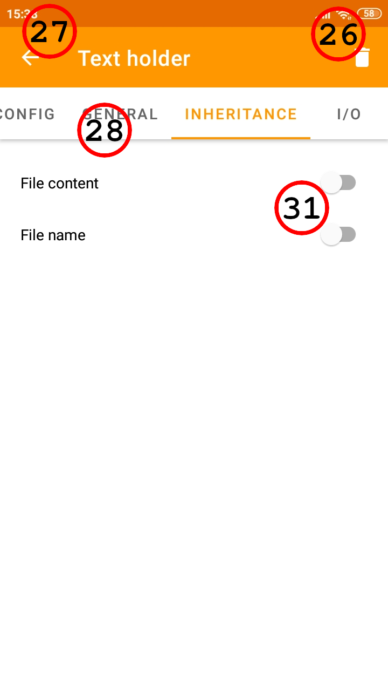

<ul>
	<li>26) Clicking this button will delete the selected component from the current pipeline.</li>
	<li>27) Back button that will close the component editor and return you to the edit pipeline screen.</li>
	<li>28) The tab menu. Use it to navigate between configuration, general, inheritance and I/O.</li>
	<li>29) Component configuration.</li>
	<li>30) Label and description.</li>
	<li>31) Inheritance items.</li>
</ul>

I/O | Add New Connection
----|--------------------
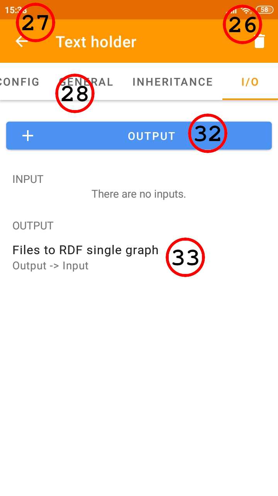|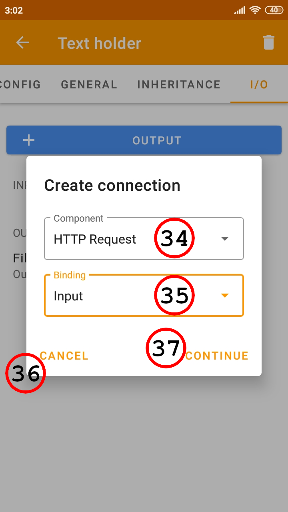

<ul>
	<li>32) Binding item. Click to create a connection attached to this binding.</li>
	<li>33) Connection item. Swipe to left side to delete this connection.</li>
	<li>34) Target or source component for a new connection.</li>
	<li>35) Select binding of selected component.</li>
	<li>36) Clicking the "cancel" button or outside of the dialog window will cancel the connection creation.</li>
	<li>37) Clicking the "continue" button will save the connection.</li>
</ul>

### Video tutorials
Video tutorials can be found [here](https://palda97.github.io/AndroidEtlClientDeveloperDocumentation/videos.html).